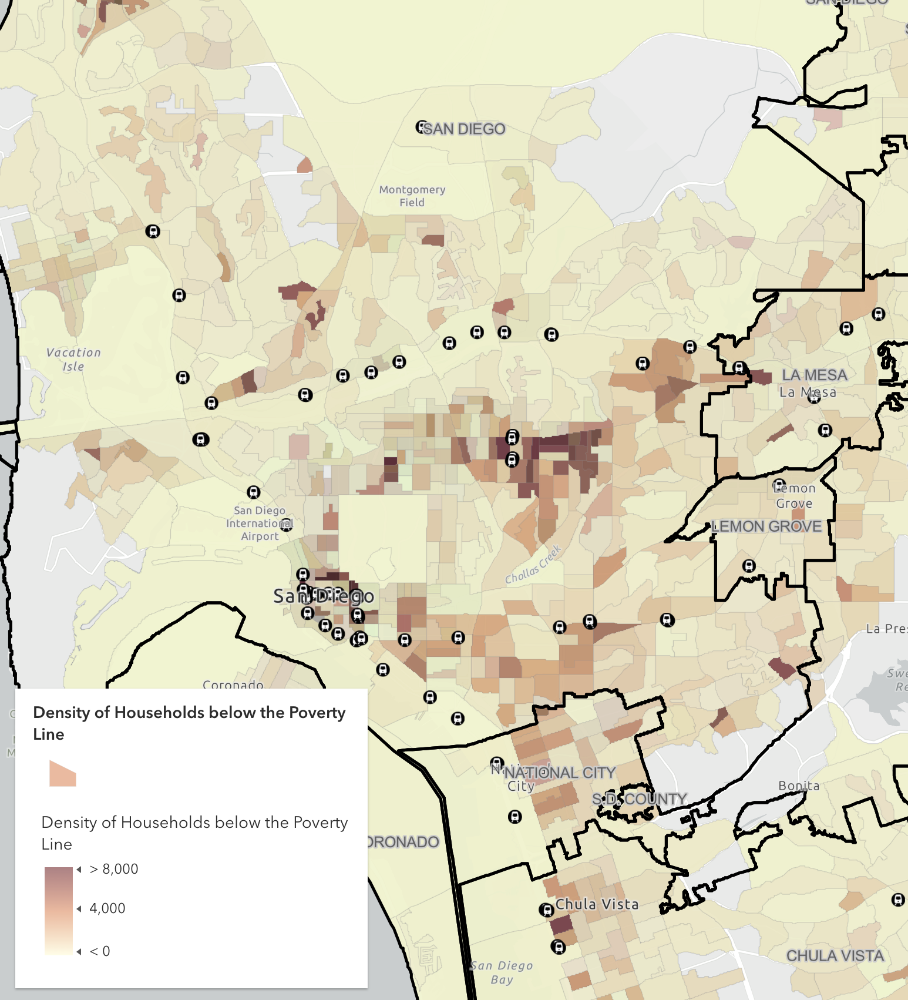
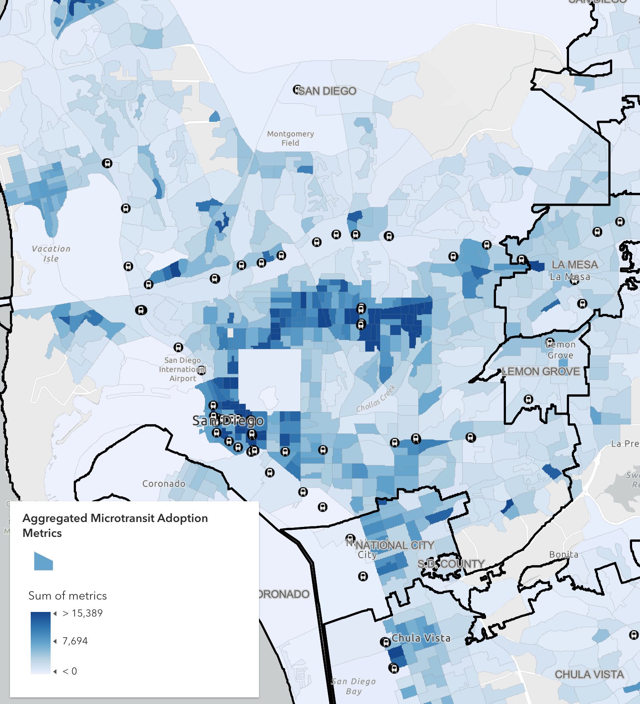
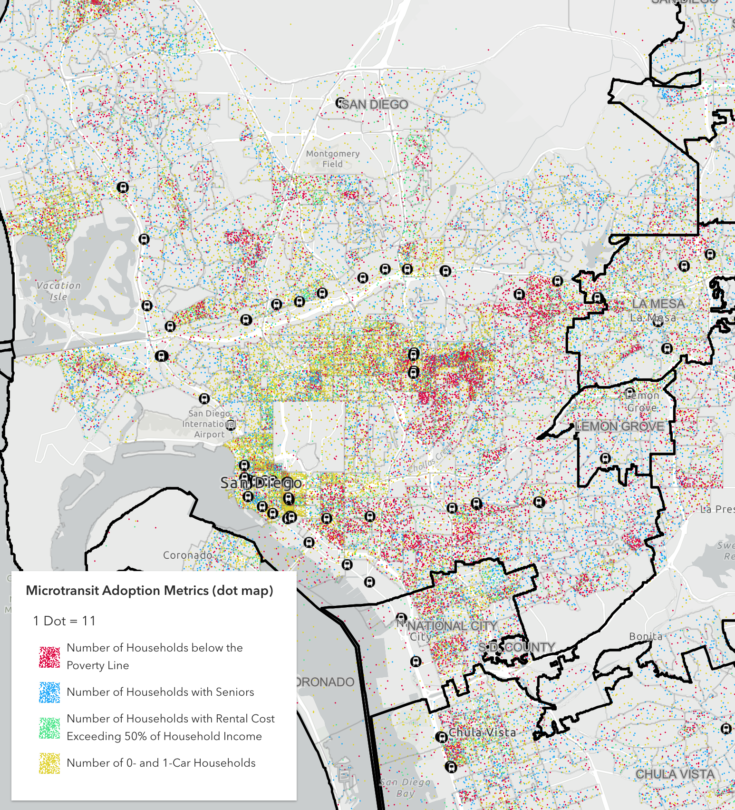

# Mapping of Microtransit Adoption Potential

## Introduction
This is part of the work by the Microtransit subteam of the SanDiego350 Transportation Team. We have developed a mapping of high-potential microtransit zones, focusing on Trolley Stops, demographic features, and municipal boundaries. Particularly, we provide insightful analysis into these demographic features.

## Dataset

Our main datasets are sourced from the [SanGIS/SANDAG GIS Data Warehouse](https://rdw.sandag.org/Account/gisdtview) and [Census.GOV](https://data.census.gov/all?g=050XX00US06073$1500000).

**MTS Trolley Stops**: This dataset [MTS Trolley Stops](./data/MTS%20Trolley%20Stop.gpkg) contains main stations (location_type=1) and sub-stops (location_type=0), constructed from MTS Static GTFS files (https://www.sdmts.com/business-center/app-developers) and processed using QGIS.

**MTS Transit Routes**: [MTS Transit Routes](./data/MTS%20Transit%20Routes.geojson) includes transit routes and associated bus/trolley stops, built from https://www.sdmts.com/google_transit_files/google_transit.zip using tools from https://github.com/BlinkTagInc/gtfs-to-geojson.

**Municipal Boundaries**: Downloadable at [Municipal Boundaries](https://rdw.sandag.org/Account/GetFSFile.aspx?dir=Jurisdiction&Name=Municipal_Boundaries.zip), from the SANDAG/SanGIS Regional GIS Data Warehouse section "Jurisdiction".

**Census Block Groups** and **Census Tracts**: These datasets ([Census Block Groups](https://rdw.sandag.org/Account/GetFSFile.aspx?dir=Census&Name=CENSUS_BLOCKGROUPS.zip) and [Census Tracts](https://rdw.sandag.org/Account/GetFSFile.aspx?dir=Census&Name=CENSUS_TRACTS_2020.zip)) represent the 2020 US Census Bureau Block Groups and Census Tracts for San Diego County derived from the CENSUS_BLOCK layer.

We also utilize the following census datasets from [Census.GOV](https://data.census.gov/all?g=050XX00US06073$1500000) (2022 version):

| Metric | ID | Dataset |
| ------ | -- | ------- |
| Density of Households below the Poverty Line | B17017 | Poverty Status in the Past 12 Months by Household Type by Age of Householder |
| Density of Households with Seniors | B11007 | Households by Presence of People 65 Years and Over, Household Size and Household Type |
| Density of Households with Rental Cost Exceeding 50% of Household Income | B25070 | Gross Rent as a Percentage of Household Income in the Past 12 Months |
| Density of 0- and 1-Car Households | B08201 | Household Size by Vehicles Available. Only available at the Census Tract level. |

## Results

Explore the interactive [ArcGIS map](https://ucsdonline.maps.arcgis.com/apps/mapviewer/index.html?webmap=eb482be5da7141ae8989c57dc311da55) to view the results.

We provided multiple methods of visualizing the results:
- **Microtransit Adoption Metrics**: Includes all metrics represented in color; darker colors indicate higher densities.
- **Aggregated Microtransit Adoption Metrics**: Customize the way of aggregating the metrics using the expression in `Styles`. Currently, it aggregates the data using `$feature.vehicle + $feature.poverty + $feature.rent + $feature.senior`
- **Microtransit Adoption Metrics (Dot Map)**: Includes all metrics in dot map representation.

## How to Use

We provide a [notebook](./notebook.ipynb) with the data processing and analysis code. You need to run it in an ArcGIS Online Notebook.
